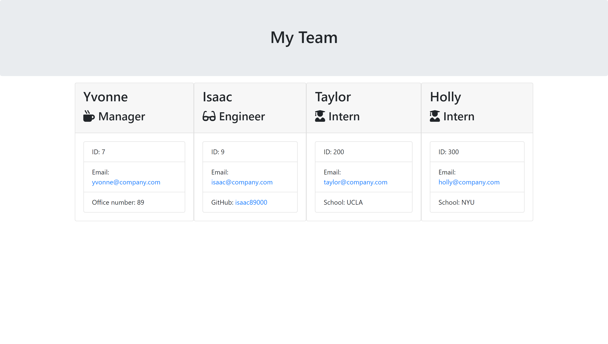

# Team Profile Generator

## Table of Contents

- [Overview](#overview)
  - [Description](#description)
- [Installation](#installation)
- [Usage](#usage)
- [License](#license)
- [Contributing](#contributing)
- [Tests](#tests)
- [Questions](#questions)

## Overview

### Description
This project is a command-line application to generate a HTML file using node.js based off of users' answers with the given prompts. The application asks the user about the manager's details before giving them a choice to add an engineer or an intern, or to finish building the team. The generated HTML includes Bootstrap styling with the answered details about the team members. Below is a screenshot of the application.

## Installation
Install Node.js on your local machine. Clone the repository on your local machine then open up the project in your code editor. In the terminal, navigate to the project directory and install the `fs`, `path`, `inquirer` and `util` packages using the command `npm install`, and `npm install --save-dev jest` for dev dependencies for testing.

## Usage
In your terminal, run the command `node index.js` to be prompted with questions about the team. This will generate a HTML file in the output directory and you can open in browser to view the application.

## License

## Contributing
To contribute to this project, fork the repository and clone it to your local machine. Create a new branch with your changes and push them to your Github repository. Open and create a pull request for it to be reviewed.

## Tests
Test this application by navigating to the project directory on your local machine and run the command `npm test`.

## Questions
Contact me at [GitHub](https://github.com/yvonne0711) or [yvonnewong1107@gmail.com](mailto:yvonnewong1107@gmail.com)
